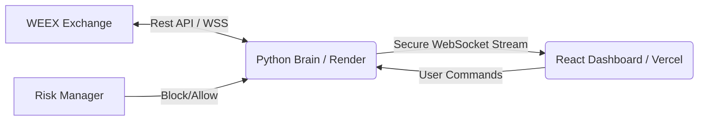

# Nexus-7: GlassBox Trading Terminal 🧠


> **"Trust shouldn't be blind. It should be visible."**

**Nexus-7** is the first "GlassBox" algorithmic trading terminal built exclusively for the **WEEX Alpha Awakens 2025 Hackathon**. Unlike standard "Black Box" bots that hide their logic, Nexus-7 visualizes its AI decision-making process in real-time—streaming sentiment analysis, volatility calculations, and risk checks directly to the user's dashboard.

---

## 🔗 Live Demo
- **Live Terminal:** [https://nexus-7-weex-terminal.vercel.app](https://nexus-7-weex-terminal.vercel.app)
- **Demo Video:** [Watch on YouTube](https://youtu.be/uBmzo1J6hp8)

---

## ✨ Key Features

### 🧠 Real-Time AI Logic Stream
A scrolling console that visualizes the "brain" of the bot. Watch as the AI:
- Scans the WEEX order book for liquidity.
- Analyzes market sentiment (Bullish/Bearish confidence scores).
- Calculates volatility metrics (Standard Deviation, ATR).

### 🛡️ Autonomous Risk Manager
Safety is hard-coded into the core. The independent Risk Module:
- **Caps Leverage at 5x:** Strictly adheres to hackathon compliance rules.
- **Exposure Checks:** Prevents over-allocation (>20% portfolio) in a single asset.
- **Kill Switch:** Instantly halts trading if latency exceeds 200ms.

### ⚡ WEEX Integration
- Built using `ccxt` for standardized connectivity to WEEX Spot and Futures markets.
- Zero-lag WebSocket connection for price updates.

### 📊 Command Center UI
- **Active Strategies:** Real-time PnL tracking for Arbitrage and Trend Following modules.
- **Audio Feedback:** Distinct sound cues for "Opportunity Found," "Trade Executed," and "Risk Alert."
- **Multi-Asset Support:** Monitors BTC/USDT, SOL/USDT, and ETH/USDT simultaneously.

---

## 🛠️ Tech Stack

### The Brain (Backend)
- **Language:** Python 3.10+
- **Framework:** FastAPI (AsyncIO)
- **Deployment:** Render (Cloud)
- **Key Libraries:** `ccxt` (Exchange API), `numpy` (Math), `websockets` (Streaming)

### The Face (Frontend)
- **Framework:** React + TypeScript (Vite)
- **Deployment:** Vercel
- **Styling:** Tailwind CSS + ShadcnUI
- **State:** React Hooks (Custom `useTradeSignals`)

---

## 🏗️ Architecture

The system uses a decoupled **"Brain & Face"** architecture to ensure high performance.


The Brain runs a continuous while True loop on Render, analyzing markets 24/7.

The Brain pushes "Thoughts" (Logs) and "Actions" (Trades) to the Frontend via WebSockets.

The Frontend is purely visual—it displays whatever the Brain tells it, ensuring the user sees exactly what the algorithm sees.

🚀 Local Installation
If you want to run Nexus-7 locally on your machine:

1. Clone the Repo
```
git clone [https://github.com/Xzavior34/nexus-7-weex-terminal.git](https://github.com/Xzavior34/nexus-7-weex-terminal.git)
cd nexus-7-weex-terminal
2. Setup Backend (The Brain)
```
```

cd weex_brain
python -m venv venv
source venv/bin/activate  # On Windows: venv\Scripts\activate
pip install -r requirements.txt
python main.py
The backend will start at http://localhost:8000
```
3. Setup Frontend (The Face)
Open a new terminal:
```
# Return to root
cd ..
npm install
npm run dev
The frontend will start at http://localhost:8080
```
⚠️ Hackathon Compliance Note
This project was built specifically for the WEEX Alpha Awakens competition.

Leverage: Hard-capped at 5x in risk_manager.py.

API Use: Optimized to respect WEEX rate limits.

KYC: Developed by a verified WEEX user.

👨‍💻 Developer
Built by Xzavior34 Solo Full-Stack Engineer

MIT License © 2025
